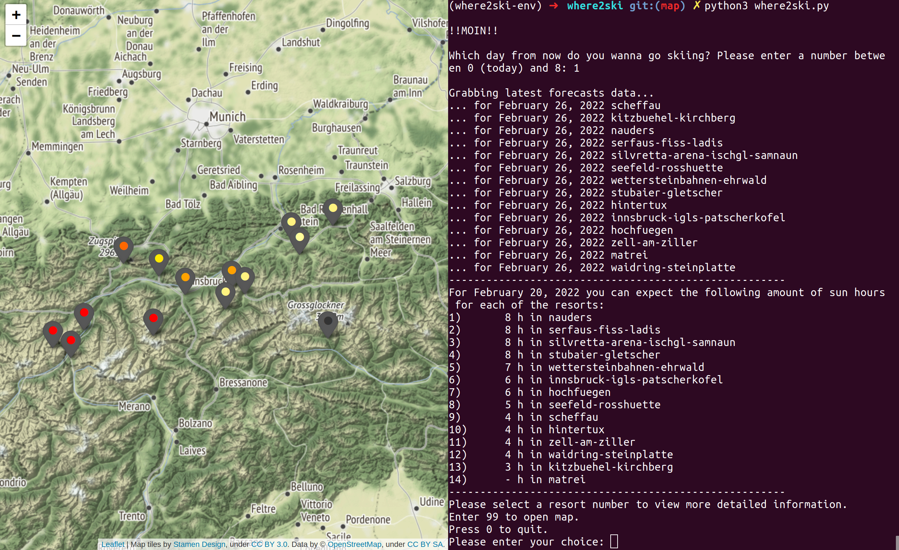
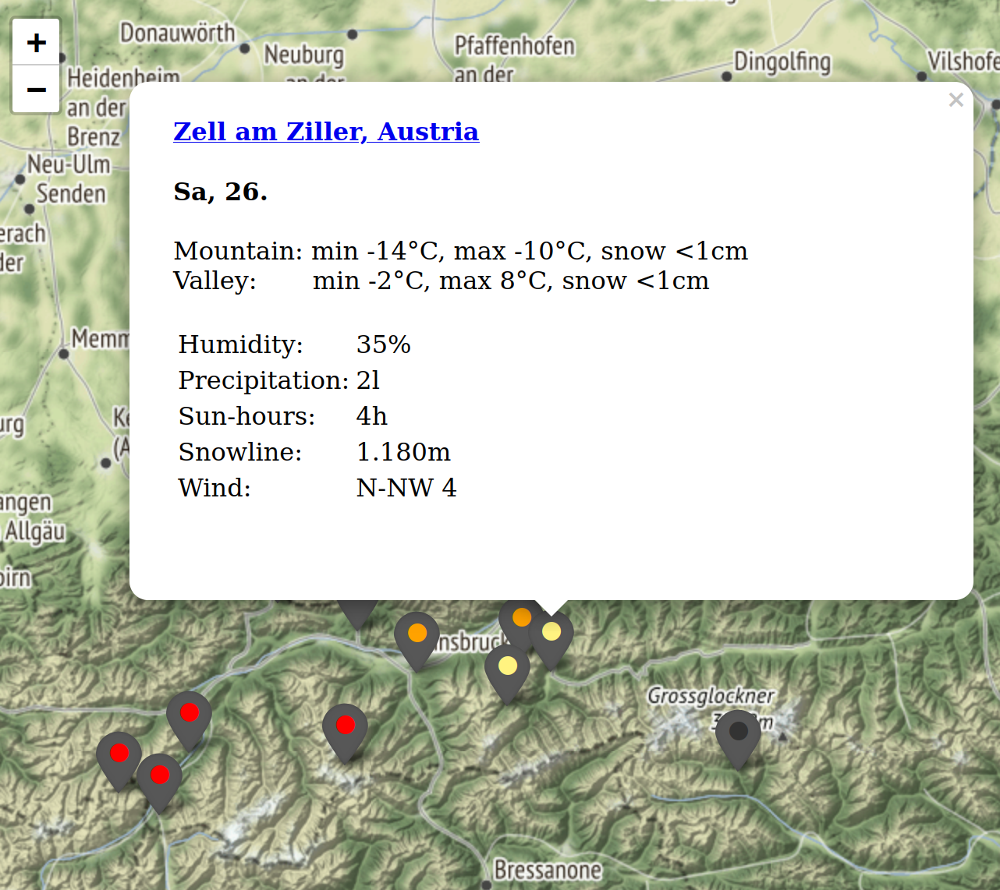

# where2ski

A little program to help you maximize your tan while skiing. 
Based on forecast data from Bergfex. Developed and tested with Python 3.6.9 under Ubuntu 18.04.





## Initial setup

### Clone project to wherever you want to place it

```sh
git clone https://github.com/cczapka/where2ski.git
```

To have the map functionality, please clone the 'map'branch

```sh

git clone --branch map https://github.com/cczapka/where2ski.git
```

### (Optional) Create a virtual env

You can verify that Python 3 is installed on your system by running:

```sh
python3 -V
```

Let’s start by installing the python3-venv package that provides the venv module.

```sh
sudo apt install python3-venv
```

Switch to the directory where you would like to store your Python 3 virtual environments. Within the directory run the following command to create your new virtual environment:

```sh
python3 -m venv where2ski-env
```

The command above creates a directory called my-project-env, which contains a copy of the Python binary, the Pip package manager, the standard Python library and other supporting files.

To start using this virtual environment, you need to activate it by running the activate script:

```sh
source where2ski-env/bin/activate
```

Once activated, the virtual environment’s bin directory will be added at the beginning of the $PATH variable. Also your shell’s prompt will change and it will show the name of the virtual environment you’re currently using.

Now that the virtual environment is activated, we can start installing, upgrading, and removing packages using pip.

### Install required packages.

```sh
pip install -r requirements.txt
```

## Execute program

```sh
python3 where2ski.py
```